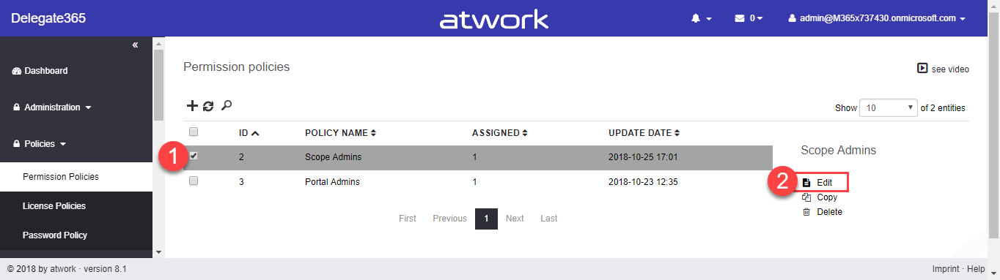
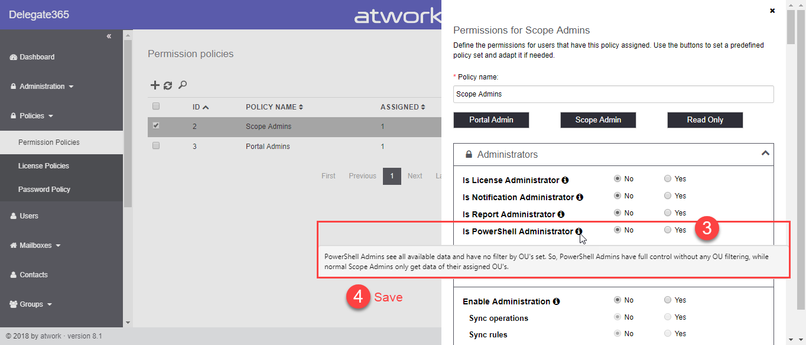
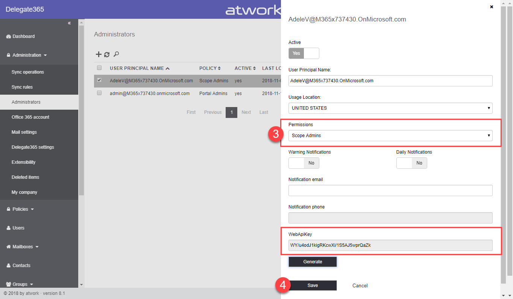

# PowerShell Permissions

## Synopsis
All Delegate365 PowerShell commands use the permissions that have been defined by the Portal Admins in the Delegate365 portal.
In Delegate365, there is a ***PowerShell Admin*** and a ***Non-PowerShell Admin*** permission that basically controls if an Admin sees all data or just the data that's assigned to him or her when using the Delegate365 PowerShell. See how to set these permissions here.

## Description
Delegate365 has a granular permission system where Portal Admins can define what modules are available for Scope Admins. PowerShell checks for the these permissions. So, if e.g. the permission "Enable contacts" is set to "No" for that admin, [Get-DContact](../Get-DContact.md) will not return any data. Additionally, Admins need to be assigned to an Organizational Unit (OU) and to domains to see any data, as in the portal. So, all these components define what data Scope Admins see. The same concept is valid for the Delegate365 PowerShell.

Basically, an Admin sees data from his or her entitled OU's. So, when running a query as [Get-DUser](../Get-DUser.md), [Get-DContact](../Get-DContact.md), [Get-DSecurityGroup](../Get-DSecurityGroup.md), or any similar resources, only data from the assigned OU's will be returned. When creating new resources or updating resources, only own data can be modified or specific commands are only possible for PowerShell Admins.

However, Portal Admins can control which Admins get the PowerShell Admins permission and which Admins are bound to their OU's. This can be defined in the permission policies and then by assigning that policy to the corresponding Administrator.

## How-To steps
To define the PowerShell permissions, you must be a Portal Admin in Delegate365. Follow these steps:
1. Open the menu "Policies" and "Permission Policies". Select the desired policy and click "Edit".

2. Find the "Is PowerShell Administrator" permission as shown in the following screenshot. If set to "Yes", all users who are assigned to that policy, can see and manage ALL data in Delegate365. For Scope Admins, this switch usually is set to "No". When set to "No" which is the default setting, these Admins will only see their "own" data, all objects that are assigned to the OU's that Admin can manage. Note that this is the a basic setting. Additionally, the modules below must be enabled for accessing the corresponding data with PowerShell.

3. Then, assign the policy to the Admin. Open "Administration" and "Administrators". Select the desired administrator and click "Edit Admin" as here.

4. In the Administrator panel, select the desired policy. Then, click "Save".

The settings will be active instantly. Repeat the steps for all policies you require for managing your Admin permissions.

***Note*** that you also find the Administrator's "WebAPIKey" here. This is the key that needs to be handed over to that Administrator to be able to use PowerShell. If the PowerShell access shall be disabled, simply generate a new WebAPIKey. Alternatively, the Admin can be deactivated (set "Active" to "No", then neither PowerShell nor the portal can be used), or deleted.

Back to the [overview](https://github.com/delegate365/PowerShell).
